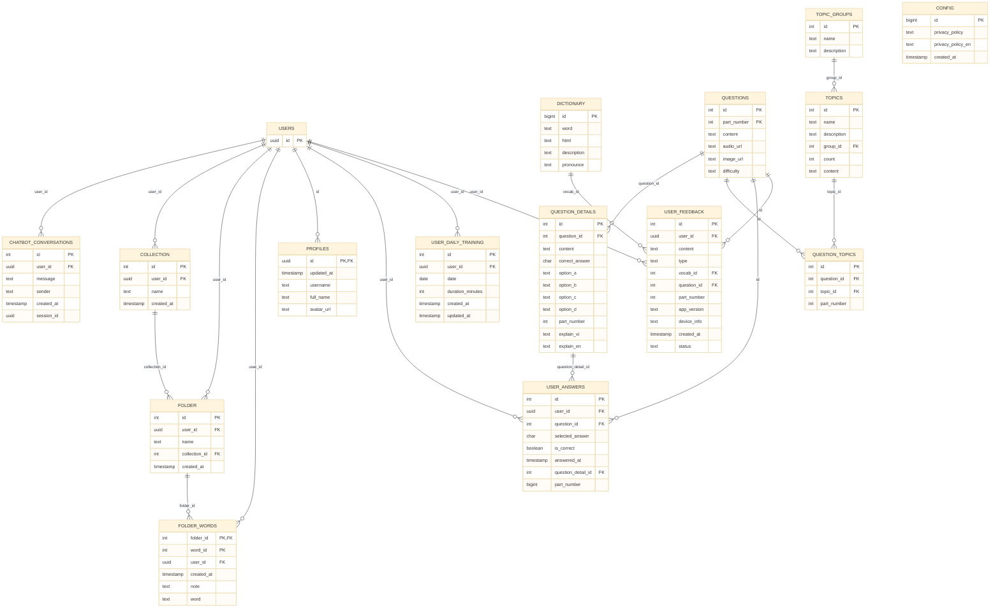
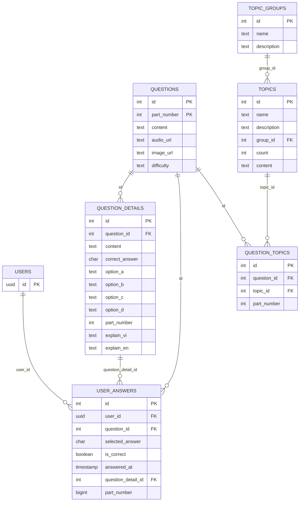

### ERD

```mermaid
---
config:
  theme: base
---
erDiagram
  USERS {
    uuid id PK
  }
  CHATBOT_CONVERSATIONS {
    int id PK
    uuid user_id FK
    text message
    text sender
    timestamp created_at
    uuid session_id
  }
  COLLECTION {
    int id PK
    uuid user_id FK
    text name
    timestamp created_at
  }
  FOLDER {
    int id PK
    uuid user_id FK
    text name
    int collection_id FK
    timestamp created_at
  }
  FOLDER_WORDS {
    int folder_id PK, FK
    int word_id PK
    uuid user_id FK
    timestamp created_at
    text note
    text word
  }
  PROFILES {
    uuid id PK, FK
    timestamp updated_at
    text username
    text full_name
    text avatar_url
  }
  DICTIONARY {
    bigint id PK
    text word
    text html
    text description
    text pronounce
  }
  QUESTION_DETAILS {
    int id PK
    int question_id FK
    text content
    char correct_answer
    text option_a
    text option_b
    text option_c
    text option_d
    int part_number
    text explain_vi
    text explain_en
  }
  QUESTIONS {
    int id PK
    int part_number PK
    text content
    text audio_url
    text image_url
    text difficulty
  }
  QUESTION_TOPICS {
    int id PK
    int question_id FK
    int topic_id FK
    int part_number
  }
  TOPICS {
    int id PK
    text name
    text description
    int group_id FK
    int count
    text content
  }
  TOPIC_GROUPS {
    int id PK
    text name
    text description
  }
  USER_ANSWERS {
    int id PK
    uuid user_id FK
    int question_id FK
    char selected_answer
    boolean is_correct
    timestamp answered_at
    int question_detail_id FK
    bigint part_number
  }
  USER_DAILY_TRAINING {
    int id PK
    uuid user_id FK
    date date
    int duration_minutes
    timestamp created_at
    timestamp updated_at
  }
  USER_FEEDBACK {
    int id PK
    uuid user_id FK
    text content
    text type
    int vocab_id FK
    int question_id FK
    int part_number
    text app_version
    text device_info
    timestamp created_at
    text status
  }
  CONFIG {
    bigint id PK
    text privacy_policy
    text privacy_policy_en
    timestamp created_at
  }
  USERS ||--o{ CHATBOT_CONVERSATIONS : "user_id"
  USERS ||--o{ COLLECTION : "user_id"
  USERS ||--o{ FOLDER : "user_id"
  USERS ||--o{ FOLDER_WORDS : "user_id"
  USERS ||--o{ PROFILES : "id"
  USERS ||--o{ USER_ANSWERS : "user_id"
  USERS ||--o{ USER_DAILY_TRAINING : "user_id"
  USERS ||--o{ USER_FEEDBACK : "user_id"
  COLLECTION ||--o{ FOLDER : "collection_id"
  FOLDER ||--o{ FOLDER_WORDS : "folder_id"
  QUESTIONS ||--o{ QUESTION_DETAILS : "question_id"
  QUESTIONS ||--o{ QUESTION_TOPICS : "id"
  QUESTIONS ||--o{ USER_ANSWERS : "id"
  QUESTIONS ||--o{ USER_FEEDBACK : "id"
  TOPICS ||--o{ QUESTION_TOPICS : "topic_id"
  TOPIC_GROUPS ||--o{ TOPICS : "group_id"
  DICTIONARY ||--o{ USER_FEEDBACK : "vocab_id"
  QUESTION_DETAILS ||--o{ USER_ANSWERS : "question_detail_id"

```

### Chức năng luyện tập & Câu hỏi TOEIC

```mermaid
erDiagram

  USERS {
    uuid id PK
  }

  QUESTIONS {
    int id PK
    int part_number PK
    text content
    text audio_url
    text image_url
    text difficulty
  }

  QUESTION_DETAILS {
    int id PK
    int question_id FK
    text content
    char correct_answer
    text option_a
    text option_b
    text option_c
    text option_d
    int part_number
    text explain_vi
    text explain_en
  }

  USER_ANSWERS {
    int id PK
    uuid user_id FK
    int question_id FK
    char selected_answer
    boolean is_correct
    timestamp answered_at
    int question_detail_id FK
    bigint part_number
  }

  QUESTION_TOPICS {
    int id PK
    int question_id FK
    int topic_id FK
    int part_number
  }

  TOPICS {
    int id PK
    text name
    text description
    int group_id FK
    int count
    text content
  }

  TOPIC_GROUPS {
    int id PK
    text name
    text description
  }

  USERS ||--o{ USER_ANSWERS : "user_id"
  QUESTIONS ||--o{ QUESTION_DETAILS : "id"
  QUESTIONS ||--o{ USER_ANSWERS : "id"
  QUESTIONS ||--o{ QUESTION_TOPICS : "id"
  QUESTION_DETAILS ||--o{ USER_ANSWERS : "question_detail_id"
  TOPICS ||--o{ QUESTION_TOPICS : "topic_id"
  TOPIC_GROUPS ||--o{ TOPICS : "group_id"
```

### Bảng 

``` mermaid
erDiagram
  CHATBOT_CONVERSATIONS {
    int id PK
    uuid user_id FK
    text message
    text sender
    timestamp created_at
    uuid session_id
  }

  COLLECTION {
    int id PK
    uuid user_id FK
    text name
    timestamp created_at
  }

  CONFIG {
    bigint id PK
    text privacy_policy
    text privacy_policy_en
    timestamp created_at
  }

  DICTIONARY {
    bigint id PK
    text word
    text html
    text description
    text pronounce
  }

  FOLDER {
    int id PK
    uuid user_id FK
    text name
    int collection_id FK
    timestamp created_at
  }

  FOLDER_WORDS {
    int folder_id PK, FK
    int word_id PK
    uuid user_id FK
    timestamp created_at
    text note
    text word
  }

  PROFILES {
    uuid id PK, FK
    timestamp updated_at
    text username
    text full_name
    text avatar_url
  }

  QUESTION_DETAILS {
    int id PK
    int question_id FK
    text content
    char correct_answer
    text option_a
    text option_b
    text option_c
    text option_d
    int part_number
    text explain_vi
    text explain_en
  }

  QUESTION_TOPICS {
    int id PK
    int question_id FK
    int topic_id FK
    int part_number
  }

  QUESTIONS {
    int id PK
    int part_number PK
    text content
    text audio_url
    text image_url
    text difficulty
  }

  TOPIC_GROUPS {
    int id PK
    text name
    text description
  }

  TOPICS {
    int id PK
    text name
    text description
    int group_id FK
    int count
    text content
  }

  USER_ANSWERS {
    int id PK
    uuid user_id FK
    int question_id FK
    char selected_answer
    boolean is_correct
    timestamp answered_at
    int question_detail_id FK
    bigint part_number
  }

  USER_DAILY_TRAINING {
    int id PK
    uuid user_id FK
    date date
    int duration_minutes
    timestamp created_at
    timestamp updated_at
  }

  USER_FEEDBACK {
    int id PK
    uuid user_id FK
    text content
    text type
    int vocab_id FK
    int question_id FK
    int part_number
    text app_version
    text device_info
    timestamp created_at
    text status
  }
```