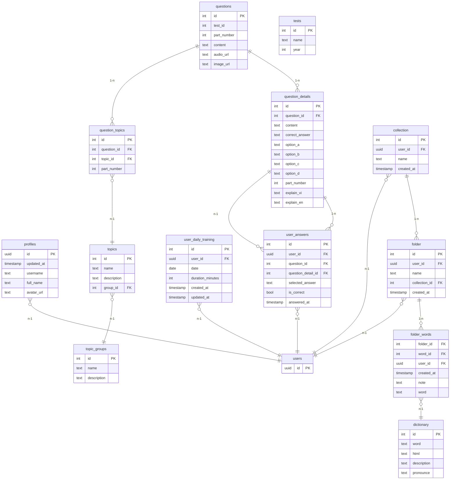

# Active Context

## Trạng thái hiện tại

-   Đã hoàn thành các module luyện tập TOEIC 7 part: Part 1–7, chấm điểm tự động, lưu lịch sử, hiển thị kết quả, test, tối ưu hiệu năng, UX/UI.
-   Đang phát triển các module: chatbot thông minh, hệ thống bài giảng, quản lý hồ sơ.

## Tính năng đang triển khai

-   Quản lý bộ sưu tập từ vựng, ghi chú cá nhân
-   Chatbot thông minh (Rasa Pro)
-   Hệ thống bài giảng (ngữ pháp, kỹ năng làm bài)
-   Quản lý hồ sơ, thống kê tiến độ

## Database hiện tại



## Vấn đề tồn đọng

-   Animation chưa tối ưu, hiệu năng mobile cần cải thiện
-   Chưa có bộ câu hỏi đầy đủ cho tất cả các part
-   Cần bổ sung test tự động cho các module chính

## Milestone ưu tiên

-   Hoàn thiện chatbot, hệ thống bài giảng (Q3/2024)
-   Tối ưu UX/UI, bổ sung test, chuẩn bị release (Q4/2024)

---

### Lệnh Supabase SQL để thêm hai trường mới vào question_details

```sql
alter table question_details
add column explain_vi text,
add column explain_en text;
```

## Refactor/Technical Debt

-   [2024-06-XX] Đã refactor toàn bộ logic submit đáp án cho các part (1-7) về 1 hàm duy nhất `submitAnswersForPart` trong service `questionApi`. Tất cả các màn luyện tập đều dùng chung hàm này, giúp giảm trùng lặp, dễ bảo trì, dễ mở rộng.

## Quy tắc UI/UX (Theme Consistency)

- Luôn sử dụng các giá trị spacing, margin, padding, borderRadius,... từ theme (hook useTheme) thay vì hardcode số trực tiếp trong style.
- Button Component sử dụng `Button` trong file `components/Button.tsx`. Lưu ý, phải đặt `ThemedText` làm child của `Button` để hiển thị text.
- Ưu tiên dùng: theme.SPACING.padding, theme.SPACING.margin, theme.BORDER_RADIUS.borderRadius, v.v.
- Mọi modal đề sử dụng `BottomSheetModal` từ `react-native-bottom-sheet-modal`, hoặc có thể sử dụng component `ToolTip` trong folder `components/ui/ToolTip`.
- Áp dụng cho toàn bộ codebase React Native/Expo của dự án TOEIC_Duel_App.

## Danh sách component hiện có trong project (2024-06)

### Gốc components/
- Input
- Loading
- AnswerOption
- NavigationButton
- AudioPlayer
- PageIndicator
- Congratulations
- Separator
- Checkbox
- Button
- ThemedText
- NotFound
- HorizontalRule
- ThemedView
- Space
- ListLoading
- Avatar
- RenderIf
- Row

### components/ui/
- Input
- Card/
  - CollectionCard
  - FolderCard
  - WordCard
  - DailyProblem
- TreeView/
  - TreeView
- Tooltip/
  - Tooltip
  - TooltipMenu
- RadioGroup/
  - RadioGroup
- TopicSelect/
  - TopicSelect
- SearchVocab/
  - SearchVocabItem
- Header/
  - Header
- Tabs/
  - Tabs
- CollapsibleTabView/
  - CollapsibleTabView
- Icon/
  - Icon
- Overlay/
  - Overlay
- Fab/
  - FAB.Provider
  - FAB
- TabBar/
  - TabBarItem
  - TabBar

### components/PersonalDictionary/
- AddToCollectionModal
- AddToFolderModal
- CreateCollectionModal
- CreateFolderModal
- RenameCollection
- RenameFolder
- AddWordModal

### components/predefinedComponents/
- QuizCard
- QuizOption
- TabbedSectionHeader
- TabbedSectionItem

---

> Đã lưu danh sách component vào activeContext.md để tham khảo nhanh khi phát triển, tái sử dụng, hoặc tra cứu UI/UX.

### Schema

-- WARNING: This schema is for context only and is not meant to be run.
-- Table order and constraints may not be valid for execution.

CREATE TABLE public.chatbot_conversations (
  id integer NOT NULL DEFAULT nextval('chatbot_conversations_id_seq'::regclass),
  user_id uuid NOT NULL,
  message text NOT NULL,
  sender text NOT NULL CHECK (sender = ANY (ARRAY['user'::text, 'bot'::text])),
  created_at timestamp with time zone DEFAULT CURRENT_TIMESTAMP,
  session_id uuid,
  CONSTRAINT chatbot_conversations_pkey PRIMARY KEY (id),
  CONSTRAINT chatbot_conversations_user_id_fkey FOREIGN KEY (user_id) REFERENCES auth.users(id)
);
CREATE TABLE public.collection (
  id integer NOT NULL DEFAULT nextval('folders_id_seq'::regclass),
  user_id uuid NOT NULL,
  name text NOT NULL,
  created_at timestamp with time zone DEFAULT CURRENT_TIMESTAMP,
  CONSTRAINT collection_pkey PRIMARY KEY (id),
  CONSTRAINT folders_user_id_fkey FOREIGN KEY (user_id) REFERENCES auth.users(id)
);
CREATE TABLE public.config (
  id bigint GENERATED ALWAYS AS IDENTITY NOT NULL,
  privacy_policy text,
  privacy_policy_en text,
  created_at timestamp with time zone DEFAULT (now() AT TIME ZONE 'utc'::text),
  CONSTRAINT config_pkey PRIMARY KEY (id)
);
CREATE TABLE public.dictionary (
  id bigint NOT NULL,
  word text,
  html text,
  description text,
  pronounce text,
  CONSTRAINT dictionary_pkey PRIMARY KEY (id)
);
CREATE TABLE public.folder (
  id integer NOT NULL DEFAULT nextval('folder_sub_id_seq'::regclass),
  user_id uuid NOT NULL,
  name text NOT NULL,
  collection_id integer NOT NULL,
  created_at timestamp with time zone DEFAULT CURRENT_TIMESTAMP,
  CONSTRAINT folder_pkey PRIMARY KEY (id),
  CONSTRAINT folder_sub_folder_id_fkey FOREIGN KEY (collection_id) REFERENCES public.collection(id),
  CONSTRAINT folder_sub_user_id_fkey FOREIGN KEY (user_id) REFERENCES auth.users(id)
);
CREATE TABLE public.folder_words (
  folder_id integer NOT NULL,
  word_id integer NOT NULL,
  user_id uuid NOT NULL,
  created_at timestamp with time zone DEFAULT CURRENT_TIMESTAMP,
  note text DEFAULT ''::text,
  word text DEFAULT ''::text,
  is_learned boolean NOT NULL DEFAULT false,
  CONSTRAINT folder_words_pkey PRIMARY KEY (folder_id, word_id),
  CONSTRAINT subfolder_words_user_id_fkey FOREIGN KEY (user_id) REFERENCES auth.users(id),
  CONSTRAINT subfolder_words_subfolder_id_fkey FOREIGN KEY (folder_id) REFERENCES public.folder(id)
);
CREATE TABLE public.profiles (
  id uuid NOT NULL,
  updated_at timestamp with time zone,
  username text UNIQUE CHECK (char_length(username) >= 3),
  full_name text,
  avatar_url text,
  CONSTRAINT profiles_pkey PRIMARY KEY (id),
  CONSTRAINT profiles_id_fkey FOREIGN KEY (id) REFERENCES auth.users(id)
);
CREATE TABLE public.question_details (
  id integer NOT NULL DEFAULT nextval('questions_id_seq'::regclass),
  question_id integer,
  content text,
  correct_answer character NOT NULL CHECK (correct_answer = ANY (ARRAY['A'::bpchar, 'B'::bpchar, 'C'::bpchar, 'D'::bpchar])),
  option_a text,
  option_b text,
  option_c text,
  option_d text,
  part_number integer,
  explain_vi text,
  explain_en text,
  CONSTRAINT question_details_pkey PRIMARY KEY (id),
  CONSTRAINT question_details_question_id_part_number_fkey FOREIGN KEY (question_id) REFERENCES public.questions(id),
  CONSTRAINT question_details_question_id_part_number_fkey FOREIGN KEY (part_number) REFERENCES public.questions(part_number),
  CONSTRAINT question_details_question_id_part_number_fkey FOREIGN KEY (part_number) REFERENCES public.questions(id),
  CONSTRAINT question_details_question_id_part_number_fkey FOREIGN KEY (question_id) REFERENCES public.questions(part_number)
);
CREATE TABLE public.question_topics (
  id integer NOT NULL DEFAULT nextval('question_groups_topics_id_seq'::regclass),
  question_id integer NOT NULL,
  topic_id integer NOT NULL,
  part_number integer,
  CONSTRAINT question_topics_pkey PRIMARY KEY (id),
  CONSTRAINT question_topics_part_number_question_id_fkey FOREIGN KEY (part_number) REFERENCES public.questions(part_number),
  CONSTRAINT question_topics_part_number_question_id_fkey FOREIGN KEY (question_id) REFERENCES public.questions(part_number),
  CONSTRAINT question_groups_topics_topic_id_fkey FOREIGN KEY (topic_id) REFERENCES public.topics(id),
  CONSTRAINT question_topics_part_number_question_id_fkey FOREIGN KEY (part_number) REFERENCES public.questions(id),
  CONSTRAINT question_topics_part_number_question_id_fkey FOREIGN KEY (question_id) REFERENCES public.questions(id)
);
CREATE TABLE public.questions (
  id integer NOT NULL,
  part_number integer NOT NULL,
  content text,
  audio_url text,
  image_url text,
  difficulty text DEFAULT 'high'::text,
  CONSTRAINT questions_pkey PRIMARY KEY (id, part_number)
);
CREATE TABLE public.topic_groups (
  id integer NOT NULL DEFAULT nextval('topic_groups_id_seq'::regclass),
  name text NOT NULL UNIQUE,
  description text,
  CONSTRAINT topic_groups_pkey PRIMARY KEY (id)
);
CREATE TABLE public.topics (
  id integer NOT NULL DEFAULT nextval('topics_id_seq'::regclass),
  name text NOT NULL UNIQUE,
  description text,
  group_id integer,
  count integer NOT NULL DEFAULT 0,
  content text,
  CONSTRAINT topics_pkey PRIMARY KEY (id),
  CONSTRAINT topics_group_id_fkey FOREIGN KEY (group_id) REFERENCES public.topic_groups(id)
);
CREATE TABLE public.user_answers (
  id integer NOT NULL DEFAULT nextval('user_answers_id_seq'::regclass),
  user_id uuid NOT NULL,
  question_id integer NOT NULL,
  selected_answer character NOT NULL CHECK (selected_answer = ANY (ARRAY['A'::bpchar, 'B'::bpchar, 'C'::bpchar, 'D'::bpchar])),
  is_correct boolean NOT NULL,
  answered_at timestamp with time zone DEFAULT CURRENT_TIMESTAMP,
  question_detail_id integer,
  part_number bigint,
  CONSTRAINT user_answers_pkey PRIMARY KEY (id),
  CONSTRAINT user_answers_question_detail_id_fkey FOREIGN KEY (question_detail_id) REFERENCES public.question_details(id),
  CONSTRAINT user_answers_question_id_part_number_fkey FOREIGN KEY (question_id) REFERENCES public.questions(part_number),
  CONSTRAINT user_answers_question_id_part_number_fkey FOREIGN KEY (part_number) REFERENCES public.questions(part_number),
  CONSTRAINT user_answers_question_id_part_number_fkey FOREIGN KEY (part_number) REFERENCES public.questions(id),
  CONSTRAINT user_answers_question_id_part_number_fkey FOREIGN KEY (question_id) REFERENCES public.questions(id),
  CONSTRAINT user_answers_user_id_fkey FOREIGN KEY (user_id) REFERENCES auth.users(id)
);
CREATE TABLE public.user_daily_training (
  id integer NOT NULL DEFAULT nextval('user_daily_training_id_seq'::regclass),
  user_id uuid NOT NULL,
  date date NOT NULL,
  duration_minutes integer DEFAULT 0,
  created_at timestamp without time zone DEFAULT now(),
  updated_at timestamp without time zone DEFAULT now(),
  CONSTRAINT user_daily_training_pkey PRIMARY KEY (id),
  CONSTRAINT user_daily_training_user_id_fkey FOREIGN KEY (user_id) REFERENCES auth.users(id)
);
CREATE TABLE public.user_feedback (
  id integer NOT NULL DEFAULT nextval('user_feedback_id_seq'::regclass),
  user_id uuid,
  content text NOT NULL,
  type text NOT NULL CHECK (type = ANY (ARRAY['general'::text, 'vocab_meaning'::text, 'question_explain'::text, 'question'::text])),
  vocab_id integer,
  question_id integer,
  part_number integer,
  app_version text,
  device_info text,
  created_at timestamp with time zone DEFAULT now(),
  status text DEFAULT 'new'::text,
  CONSTRAINT user_feedback_pkey PRIMARY KEY (id),
  CONSTRAINT user_feedback_question_id_part_number_fkey FOREIGN KEY (part_number) REFERENCES public.questions(part_number),
  CONSTRAINT user_feedback_question_id_part_number_fkey FOREIGN KEY (part_number) REFERENCES public.questions(id),
  CONSTRAINT user_feedback_question_id_part_number_fkey FOREIGN KEY (question_id) REFERENCES public.questions(id),
  CONSTRAINT user_feedback_vocab_id_fkey FOREIGN KEY (vocab_id) REFERENCES public.dictionary(id),
  CONSTRAINT user_feedback_user_id_fkey FOREIGN KEY (user_id) REFERENCES auth.users(id),
  CONSTRAINT user_feedback_question_id_part_number_fkey FOREIGN KEY (question_id) REFERENCES public.questions(part_number)
);
CREATE TABLE public.user_streaks (
  id integer NOT NULL DEFAULT nextval('user_streaks_id_seq'::regclass),
  user_id uuid NOT NULL,
  current_streak integer DEFAULT 0,
  longest_streak integer DEFAULT 0,
  last_streak_date date,
  created_at timestamp without time zone DEFAULT now(),
  updated_at timestamp without time zone DEFAULT now(),
  CONSTRAINT user_streaks_pkey PRIMARY KEY (id),
  CONSTRAINT user_streaks_user_id_fkey FOREIGN KEY (user_id) REFERENCES auth.users(id)
);