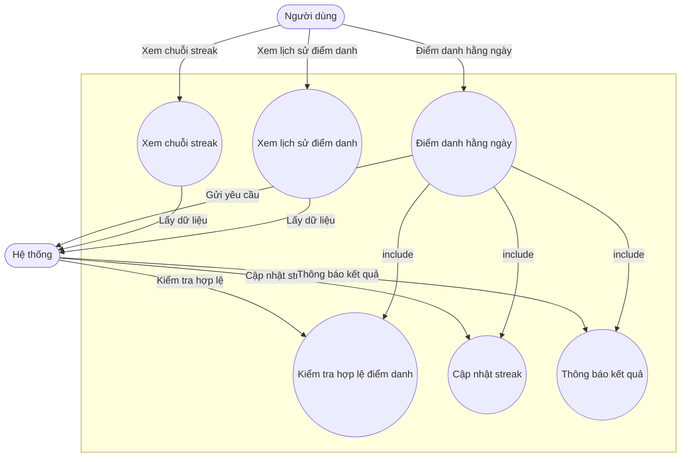

# Progress

## Tổng quan tiến độ
- Khởi tạo dự án: ✅
- Thiết kế UI/UX tổng thể: ⏳ (đang làm)
- Xây dựng chức năng từ điển tra cứu: ✅
- Xây dựng chức năng luyện tập Part 1: ✅
- Xây dựng chức năng luyện tập Part 2-7: ✅
- Tích hợp chấm điểm tự động, lưu lịch sử luyện tập: ✅
- Hiển thị kết quả, phản hồi chi tiết, thống kê tiến độ: ✅
- Viết test cho module luyện tập: ✅
- Kiểm thử, tối ưu hiệu năng, UX/UI cho luyện tập: ✅
- Xây dựng chức năng chatbot (Rasa Pro): ⏳ (đang làm)
- Xây dựng hệ thống bài giảng: ⏳ (chưa bắt đầu)
- Xây dựng chức năng quản lý hồ sơ: ⏳ (chưa bắt đầu)
- Tối ưu UX/UI, animation: ⏳ (chưa bắt đầu)
- Viết test tự động cho các module: ⏳ (chưa bắt đầu)
- Kiểm thử tổng thể, sửa lỗi: ⏳ (chưa bắt đầu)
- Viết tài liệu hướng dẫn sử dụng: ⏳ (chưa bắt đầu)

## Ghi chú
- Ưu tiên hoàn thiện chatbot, hệ thống bài giảng trong các milestone tiếp theo.
- Cập nhật tiến độ hàng tuần hoặc khi hoàn thành milestone quan trọng.

## Refactor/Technical Debt
- [2024-06-XX] Đã refactor logic submit đáp án cho các part 1-7 về 1 hàm duy nhất trong service, trạng thái: Hoàn thành. 

