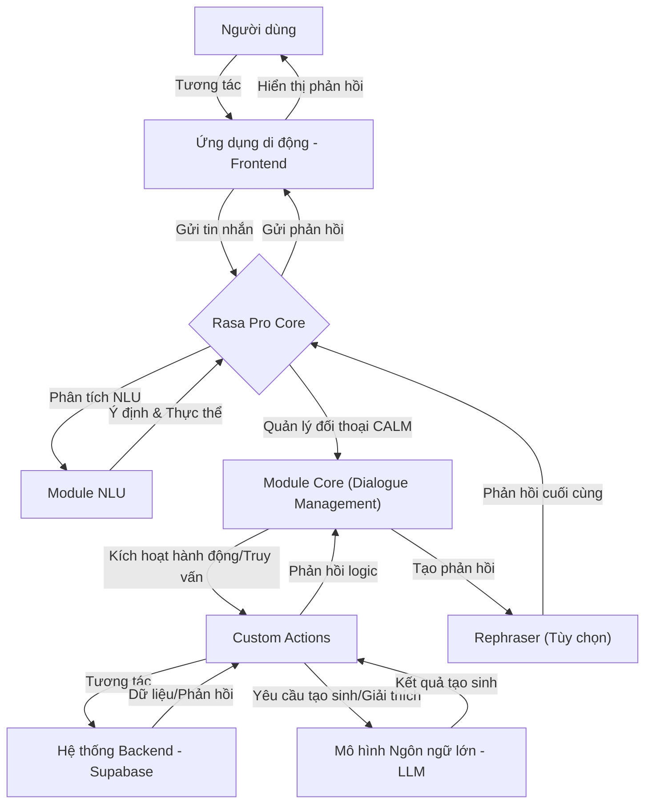
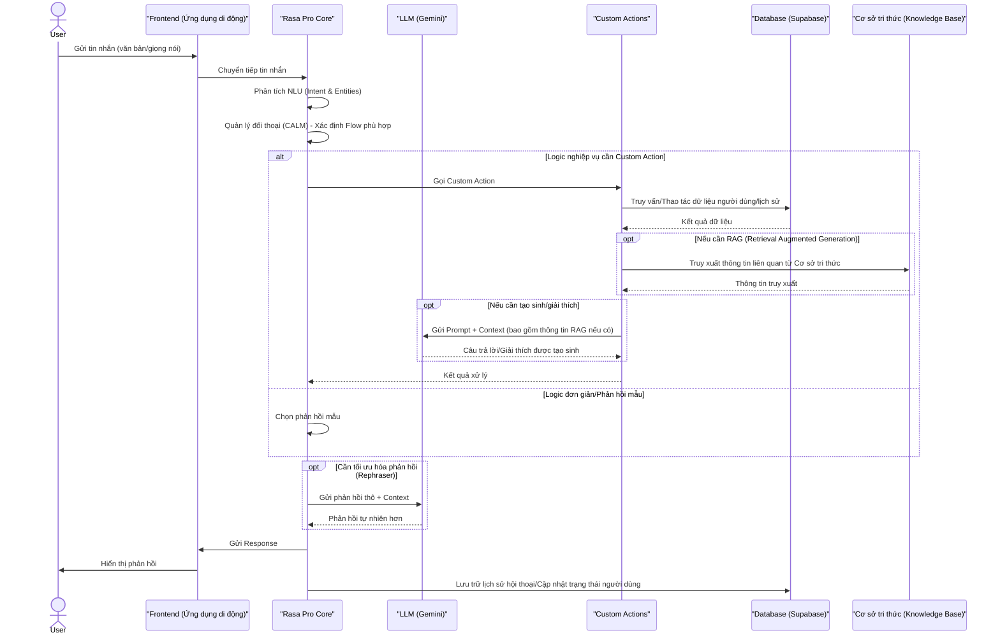

# Project Brief

## Project Summary

### Product Goals & Audience
- Hỗ trợ người dùng luyện thi TOEIC hiệu quả, vui vẻ, có tính cạnh tranh.
- Đối tượng: học sinh, sinh viên, người đi làm cần chứng chỉ TOEIC.
- Môi trường: Ứng dụng di động (Android, iOS), Web (PWA), ưu tiên mobile-first.
- Đa nền tảng, đồng bộ dữ liệu qua Supabase, tích hợp chatbot AI (Rasa Pro).

### Key Technologies & Architecture
- **Frontend:** React Native (Expo), React (Web), Expo Router, Modular UI Components, Responsive Design.
- **Backend:** Supabase (PostgreSQL, Auth, Storage, Realtime), Drizzle ORM (schema, migration), Serverless pattern.
- **State/Data:** Context API, Zustand, React Query, Repository Pattern, Custom Hook.
- **Dev Tools:** Git, GitHub, Expo CLI, EAS, Jest, Drizzle Kit, GitHub Actions (CI/CD).
- **Other:** Lottie, toastify-react-native, react-hook-form, ...

### System Patterns
- Serverless backend, realtime sync qua Supabase subscription.
- Repository pattern cho data access, context + zustand cho state.
- Tách logic qua custom hook, UI component tái sử dụng.
- Tối ưu cho mobile, theme consistency, responsive.

### Database (ERD - chính)
- users, profiles, questions, question_details, user_answers, user_daily_training, tests, topics, topic_groups, question_topics, collection, folder, folder_words, dictionary
- user_daily_training: lưu tổng thời gian luyện tập từng ngày, từng user (duration_minutes), liên kết users

### Component Library
- Đầy đủ các UI component: Card, Tab, Tooltip, TreeView, RadioGroup, SearchVocab, Header, Tabs, CollapsibleTabView, Icon, Overlay, Fab, TabBar, ...
- Có các component quản lý từ điển cá nhân, quiz, modal, ...

### Progress & Milestones
- Đã hoàn thành: luyện tập TOEIC 7 part, chấm điểm tự động, lưu lịch sử, test, tối ưu hiệu năng, UI/UX.
- Đang làm: chatbot thông minh (Rasa Pro), hệ thống bài giảng, quản lý hồ sơ, filter câu hỏi, daily streak.
- Milestone ưu tiên: Hoàn thiện chatbot, hệ thống bài giảng (Q3/2024); Tối ưu UX/UI, bổ sung test, chuẩn bị release (Q4/2024).

### Outstanding Issues
- Animation chưa tối ưu, hiệu năng mobile cần cải thiện.
- Chưa có bộ câu hỏi đầy đủ cho tất cả các part.
- Cần bổ sung test tự động cho các module chính.

### Task & Enhancement Highlights
- Daily Streak: điểm danh, thống kê thời gian luyện tập mỗi ngày (tính bằng tổng thời gian app foreground), Bar Chart, streak, đồng bộ offline/online.
- Filter câu hỏi theo topic/trạng thái, tối ưu hiệu năng filter.
- Refactor logic submit đáp án về 1 hàm duy nhất, dễ bảo trì.

---

## Project Name
TOEIC Duel App

## Overview
Dự án phát triển một ứng dụng di động hỗ trợ luyện thi TOEIC, tích hợp từ điển tra cứu và chatbot thông minh, nhằm cung cấp một công cụ học tập toàn diện, giúp người dùng cải thiện kỹ năng nghe, đọc, và giao tiếp tiếng Anh. Ứng dụng được thiết kế để đáp ứng nhu cầu của sinh viên và người đi làm, với giao diện thân thiện và tính năng tương tác cao.

## Key Features
- Bài kiểm tra luyện tập: Mô phỏng các bài thi TOEIC nghe (Phần 1-4) và đọc (Phần 5-7), cung cấp điểm số, phản hồi chi tiết, và lịch sử kết quả.
- Từ điển tra cứu: Cơ sở dữ liệu từ vựng với định nghĩa, ví dụ, phát âm, và ghi chú liên quan đến TOEIC, hỗ trợ tìm kiếm nhanh và lưu từ yêu thích.
- Chatbot thông minh: Trợ lý AI sử dụng Rasa Pro để dịch từ vựng, giải thích ngữ pháp, đề xuất chủ đề trò chuyện, và gửi thông báo nhắc nhở học
- Quản lý hồ sơ: Theo dõi tiến độ học tập, lịch sử thi, và thành tích cá nhân.
- Hệ thống bài giảng: Cung cấp các bài giảng ngữ pháp, kỹ thuật thi toiec, và các tài liệu học tập khác.

## Stakeholders
- Người học TOEIC

## Success Criteria
- Ứng dụng hoạt động ổn định trên android
- Giao diện thân thiện, dễ sử dụng
- Đáp ứng nhu cầu luyện thi TOEIC thực tế 
- Tích hợp được chatbot Rasa Pro
- Tích hợp được từ điển tra cứu
- Tích hợp được hệ thống bài giảng
- Tích hợp được quản lý hồ sơ
- Tích hợp được bài kiểm tra luyện tập

---

## Project Directory Structure

```
TOEIC_Duel_App
  .cursor/
    rules/
      isolation_rules/
        Core/
        Level1/
        Level2/
        Level3/
        Level4/
        Phases/
          CreativePhase/
        visual-maps/
          van_mode_split/
            van-qa-checks/
            van-qa-utils/
  .expo/
    types/
    web/
      cache/
        production/
          images/
            android-adaptive-foreground/
            android-standard-circle/
            android-standard-square/
            splash-android/
  .vscode/
    .react/
  android/
    app/
      src/
        debug/
        main/
          java/
            com/
              dinhvan111/
                TOEIC_Duel_App/
          res/
            drawable/
            drawable-hdpi/
            drawable-mdpi/
            drawable-xhdpi/
            drawable-xxhdpi/
            drawable-xxxhdpi/
            mipmap-anydpi-v26/
            mipmap-hdpi/
            mipmap-mdpi/
            mipmap-xhdpi/
            mipmap-xxhdpi/
            mipmap-xxxhdpi/
            values/
            values-night/
    build/
      generated/
        autolinking/
    gradle/
      wrapper/
  app/
    (protected)/
      (modal)/
        word_search/
      (tabs)/
        learn/
        problems/
          questions/
            part1/
            part2/
            part3/
            part4/
            part5/
            part6/
            part7/
        profile/
          collections/
            [collectionId]/
              [folderId]/
  assets/
    animations/
    data/
    db/
    fonts/
      MonaSans/
        __MACOSX/
          Mona Sans/
        Mona Sans/
          OTF/
          TTF/
          WOFF 2/
      static/
    icons/
    images/
      app/
      toolbarIcon/
  components/
    __tests__/
      __snapshots__/
    PersonalDictionary/
    predefinedComponents/
    ui/
      Card/
      CollapsibleTabView/
      Fab/
      Header/
      Icon/
      Overlay/
      RadioGroup/
      react-native-rasa/
      SearchVocab/
      TabBar/
      Tabs/
      Tooltip/
      TopicSelect/
      TreeView/
  config/
  constants/
  contexts/
    Auth/
    Localization/
    Setting/
  custom_modes/
  db/
  drizzle/
    meta/
  hooks/
  memory-bank/
  services/
  types/
  utils/
  .eslintrc.js
  .gitignore
  .gitignore copy
  app.json
  babel.config.js
  drizzle.config.ts
  eas.json
  expo-env.d.ts
  metro.config.js
  package-lock.json
  package.json
  project_structure.mmd
  README.md
  tsconfig.json
```






``` 
@startuml
start
:Chọn part (1-7);
:Hiển thị danh sách câu hỏi;
while (Còn muốn làm câu hỏi?) is (Có)
  :Chọn câu hỏi;
  :Hiển thị nội dung câu hỏi;
  :Chọn đáp án;
  if (Người dùng bấm "Submit"?) then (Có)
    :Kiểm tra đáp án;
    if (Trả lời đúng?) then (Đúng)
      :Hiển thị kết quả: Đúng;
      :Hiển thị giải thích;
      :Chuyển sang câu hỏi mới;
    else (Sai)
      :Hiển thị kết quả: Sai;
      :Hiển thị giải thích;
      ' Quay lại vòng lặp để người dùng chọn tiếp hoặc dừng
    endif
  else (Không)
    :Yêu cầu bấm "Submit";
    - Quay lại bước bấm "Submit"
  endif
endwhile (Không)
stop
@enduml
```